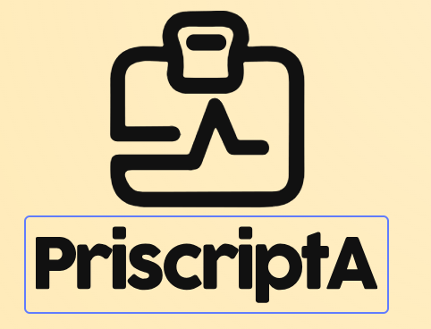
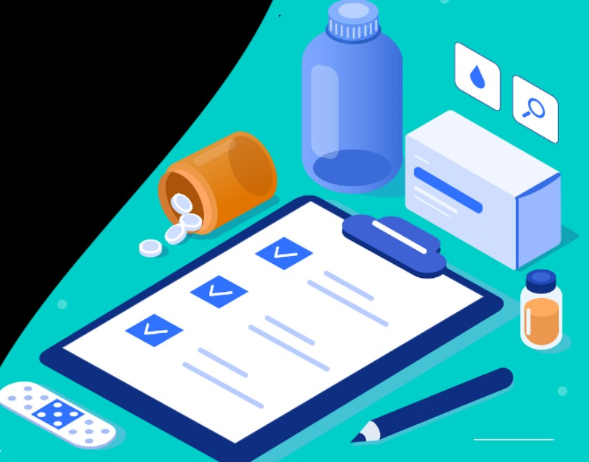
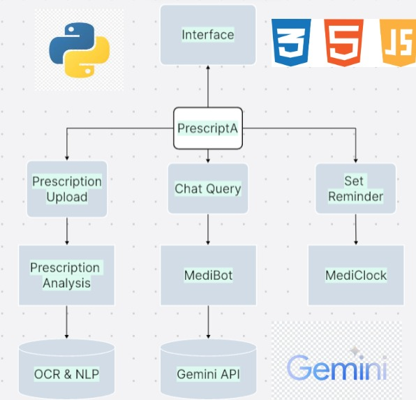
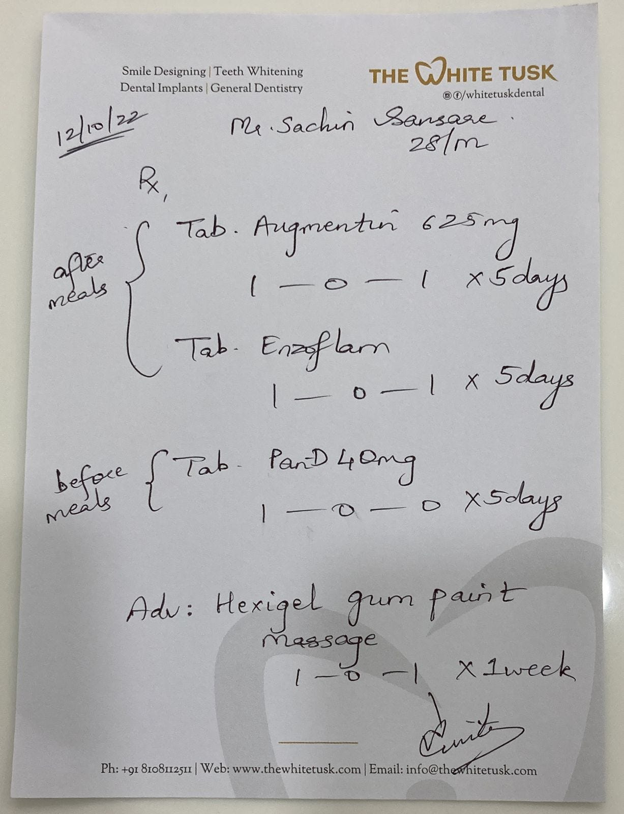
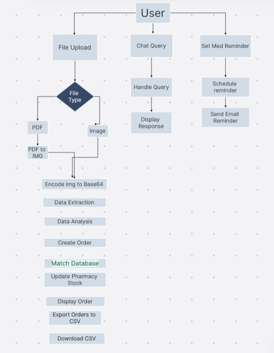

#  PrescriptA💊
                    
 <br>
  <p align="center">
    
  </p>

                         
Priscripta is an AI-driven Project designed to enhance pharmacy operations, reducing errors and improving efficiency .This is a project designed for google girl hackathon 2025 which uses the advanced technologies of Machine learning and Generative Ai to read the handwritten priscriptions given by the doctor.The aim of this project is to optimizes prescription handling, enhances patient safety, and streamlines pharmacy management—making healthcare smarter, faster, and more reliable.


## Key Features

<br>
<p align="center">
    
</p>

✅ **Prescription Reader** – A Python-based AI model that accurately reads and analyzes handwritten prescriptions, minimizing human errors.

🤖 **MedBot** – An intelligent chatbot that assists pharmacists and patients by answering queries about prescribed medicines, dosages, and potential interactions.

📦 **Medication Database** – A structured inventory system that tracks medicine availability in real time, ensuring stock is managed effectively.

💳 **Order & Billing** – An automated system that cross-checks prescriptions, processes orders, and generates bills seamlessly, improving workflow efficiency.

⏳ **MediClock**- it ensures that patients never miss a dose by allowing them to schedule medication reminders via email.

## Demo


### Screenshots
<div align="center">
    
    
</div>
<div align="center">
    
    
</div>
<div align="center">
    
    
</div>
<div align="center">
    
    
</div>
<div align="center">
    
   
    
</div>

## Technologies Used
- **Frontend:** React JS, HTML,CSS
- **Backend:** Python (Streamlit)
- **ML Techniquies:** NLP,PAI-driven OCR (Optical Character Recognition)
- **ML Libraries:** Streamlit,Requests,Pillow(PIL),pdf2image,Base64,smtplib,io,re
- **APIs:** Gemini API
- **Database:** Firebase Firestore
- **Tools:** Lightning ai studio, VS Code

  ## Design Idea & Approach


### Architecture
<p align="center">
    
</p>

- The frontend is built with **Streamlit** for a simple UI, while the backend leverages **Python, OCR (pdf2image, PIL), and Gemini AI (Google API)** for prescription reading and chatbot responses.  
- **Priscripta** extracts **handwritten and electronic prescription details** using **OCR & AI**, ensuring **accurate medication identification**. The system **validates prescriptions** against a **medication database**, preventing **errors and stock issues**.  
- This **AI-driven chatbot**, powered by **Gemini AI**, provides **instant responses** to **pharmacist and patient queries** regarding **dosage, side effects, drug interactions, and medicine instructions**.  
- Initially designed for **limited concurrent users**, the system will scale using **cloud-based AI models, SQL/NoSQL databases, and server load balancing**. Future enhancements include **local AI models for cost efficiency**.

### Sample Prototype (Prescription)

I got a sample prescription from google as mock data since I can't get access to real patient data due to ethical reasons. I used the prescription to test my project's functionality. Below is the data sample I used :
<p align ="center">

</p>

### Project Flow

<p align="center">
    
</p>  

- The **machine learning cycle** in this process starts with a user **uploading a prescription**, which undergoes **file type classification**. If the file is a **PDF**, it is first **converted into an image** before being **encoded in Base64 format**. The system then performs **document type classification** to determine if it is a **valid prescription**. Once classified, **prescription data extraction** is carried out using **Optical Character Recognition (OCR)** and **Natural Language Processing (NLP)** techniques to retrieve **relevant medical information**. The **extracted data** is then **analyzed** to generate a **structured medication order**.  

- Next, the **medication order** is matched against a **predefined medication database** to verify **availability and accuracy**. If a **match is found**, the **pharmacy stock is updated accordingly**. The **processed orders** are then **displayed for review**, after which they can be **exported to a CSV file** for **further processing or record-keeping**.  

- In parallel, the system also provides **additional functionalities** such as **handling chat queries** by **responding to user questions** and **setting up medicine reminders**. The **reminders** are **scheduled** and **sent to users via email notifications**, ensuring **adherence to prescribed medication schedules**. Through this **structured pipeline**, the system integrates **machine learning techniques** with **practical healthcare applications**, **streamlining prescription processing and medication management efficiently**.


## Getting Started


### Setting up the ML Model API locally

1. Make sure you have the following installed:
   - Python (version 3.x)
   - pip (Python package installer)
   - Virtual environment (optional but recommended)
   - preferred to use lightning ai for faster processing
      
2.  Install Python dependencies by running:
   ```
   pip install -r requirements.txt
   ```
3. Run Your Streamlit App
   Navigate to main directory where app.py is located and run:
   ```
   streamlit run app.py
   ```
   

## Use Cases

-  **Automated Prescription Processing** – AI reads and extracts details from **handwritten and electronic prescriptions**.  
-  **Pharmacy Inventory Management** – Tracks **medicine availability** and prevents **stock shortages**.  
-  **AI Chatbot Assistance** – Answers **medicine-related queries** for **pharmacists and patients**.  
-  **Medication Ordering & Billing** – Generates **orders and bills** directly from **prescriptions**.  
-  **Patient Medicine Availability Check** – Allows users to **check stock** before visiting a **pharmacy**.  
-  **Online Medicine Ordering** – Enables **patients** to place **orders** through the **patient interface**.
-  **Automated Medication Reminders** – Sends **alerts via MediClock** to improve **patient adherence**. 
-  **Hospital & Clinic Integration** – Streamlines **medication management** within **healthcare facilities**.  


### *Social Impact of Priscripta*  

-  **Reduces Prescription Errors** – Prevent deaths and healthcare complications due to misinterpretation of Prescription
-  **Improve Medicine Accessibility** – Ensures proper management of Database increasing accessibility of Medicines in healthcare sector also enabling patients to check medicine availability and order remotely
-  **Enhances Medication Adherence** – Sends automated reminders, helping patients escpecially older patients with lack of personal care to take medicines on time.  
-  **Increases Pharmacy Efficiency** – Automates repetitive tasks such as prescription analysis , billing orders and database management allowing pharmacists to focus on patient care. 
-  **Reduces Healthcare Costs** – Prevents medication waste and optimizes stock management, lowering expenses.  

## Scopes of Improvement


- **Patient Interface:** Create a separate interface for patients and pharmacists where Pharmacist can keep track of medicine database while patient can check availability of medicines and place orders.
- **User Login:** Create an authentication system for users so that they can store their data always.
- **User Interface:** Create more interactive user interface making it more convinient to use.
- **Mobile App:** Create a mobile app for the same to increase scalability and reach.


